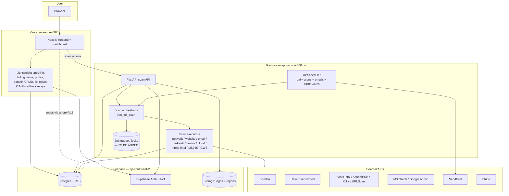

# SecureIT360 — Architecture & Security Audit

**Date:** 2026-07-21
**Scope:** Full application audit prior to Vercel / Supabase / Railway restructuring.
**Status:** AUDIT ONLY — no code, data, or infrastructure changed. Railway untouched.
**Prepared for:** Global Cyber Assurance / SecureIT360 (AU + NZ SMB cyber platform).

> **Verdict up front:** The platform is feature-rich but **NOT launch-ready**. There are
> **6 launch-blocking issues**, the most serious of which are (1) a fully **unauthenticated
> admin API** that can delete/suspend/comp any customer, (2) **daily automated scans that do
> not run at all** (broken import), and (3) **SSRF** via unvalidated scan targets. Detail below.

---

## 1. Current vs Target Architecture

### Current (as built)
- **Frontend:** Next.js 16 (app router) on Vercel. All pages are client components; talks only to the FastAPI backend over HTTP (`NEXT_PUBLIC_API_URL`). No Supabase client in the browser.
- **Backend + scan engine:** single FastAPI process on Railway (`uvicorn main:app`). 11 routers + an **in-process APScheduler** running daily scans, weekly/monthly emails, and a 5-minute HIBP watch.
- **Database/Auth:** Supabase (Postgres + Auth + one Storage bucket). Backend uses the **service-role key for nearly all queries** → RLS is bypassed; tenant isolation is enforced only in Python.
- **Domain:** `secureit360.co` (legal pages also reference `app.secureit360.co`).

### Target (requested)
- Vercel → frontend, dashboard, lightweight app APIs.
- Supabase → Postgres, Auth, Storage, **RLS actually enforced**.
- Railway → dedicated scanning engine (orchestration, execution, long jobs, scheduler).
- `secureit360.co` → Vercel; `www` → 301 → apex; `api.secureit360.co` → Railway.

### Architecture diagram (target)



---

## 2. Complete Feature Inventory

### Frontend (Next.js / Vercel) — `app/`
| Area | Route(s) | Notes |
|---|---|---|
| Marketing | `/`, `/pricing` | Public landing + region-based pricing (NZ/AU/IN/UAE). |
| Auth | `/login`, `/signup`, `/register`→`/signup`, `/verify-email`, `/auth-confirm` | JWT stored in `localStorage`; email-confirm decodes JWT and posts `user_id`. |
| Dashboard | `/dashboard`, `/dashboard/scanning` | Findings, remediation "voice guide", breach-watch tile, penalty/law info, auto-fix, password re-verify gate. Scan launcher. |
| SaaS connectors | `/saas/catalog`, `/saas/connections` | App catalog + guided connection wizard, connections list. |
| Settings | `/settings` | Profile, Team, Domains, Billing, Integrations (MS365 + Google OAuth, logo upload). |
| Admin | `/admin` | **Client-side password gate only** (`SecureIT360Admin2026!` hardcoded in bundle). |
| Legal | `/privacy`, `/terms`, `/cookie-policy` | Reference `app.secureit360.co`, Supabase Sydney, AES-256. |
| Server routes | `app/api/google/callback`, `app/api/ms365/callback` | Thin OAuth relays → backend does token exchange (no secrets client-side). ✅ |

Shared components: Navbar/BottomNav/SessionTimeout (idle logout + token refresh)/TrialBanner/Toast/UpgradePrompt; dashboard `BreachWatchTile`; findings `FindingActionsBar`; SaaS wizard set.

### Backend (FastAPI / Railway) — `backend/`
| Module | Router prefix | Responsibility |
|---|---|---|
| `routes/auth.py` | `/auth` | Register, login, refresh, invite, list users, verify-email, **+ 7 unauthenticated `/admin/*` endpoints**. |
| `routes/scans.py` | `/scans` | 6 scan triggers + full scan, list scans/findings, auto-fix. |
| `routes/billing.py` | `/billing` | Stripe plans/subscription/checkout/portal/webhook. |
| `routes/dashboard.py` | `/dashboard` | Scores, penalties, compliance, breach-watch aggregation. |
| `routes/domains.py` | `/domains` | Add/list/delete domains, DNS-TXT ownership verification. |
| `routes/tenants.py` | `/tenants` | Logo upload, profile get/patch. |
| `routes/integrations.py` | `/integrations` | MS365 connect/disconnect/scan. |
| `routes/google_workspace.py` | `/integrations/google` | Google Workspace OAuth + scan. |
| `routes/threat_intel.py` | `/threat-intel` | Threat-intel scan trigger. |
| `routes/saas.py` | `/saas` | Universal SaaS connector (OAuth/manual, AI recipe, scan, findings). |
| `routes/email_preview.py` | `/email` | Unauthenticated email template previews (static data). |
| `services/*` | — | Scan engines, scheduler, scoring, email, governance/regulatory mappers, auto-fix. |
| `saas_connectors/*` | — | Vault (pgcrypto), generic checks, Xero/Zoho providers, AI recipe generator. |

---

## 3. Complete Scan Inventory

All scans run **in-process on Railway** (Python `socket`/`ssl`/`httpx` + third-party REST APIs). **No external CLI tools, no shell execution anywhere** (grep for `subprocess`/`os.system`/`shell=True`/`Popen`/`eval`/`exec` = 0 matches).

| Requested capability | Status | Implementation | File |
|---|---|---|---|
| Website vuln scan | ⚠️ Weak | 4 security headers + version banners only | `services/website_scan.py` |
| Domain scan | ✅ | Most engines keyed on domain | multiple |
| IP scan | ⚠️ Partial | IP only used to key Shodan/AbuseIPDB/OTX lookups | `network_scan.py`, `threat_intel_scan.py` |
| Port scan | ⚠️ Passive | Shodan `host().ports` — **no Nmap/active scan** | `network_scan.py` |
| SSL/TLS scan | ⚠️ Partial | Cert **expiry/validity only** — no cipher/protocol/testssl | `website_scan.py` |
| DNS scan | ⚠️ Partial | DoH TXT for SPF/DMARC; `dnspython` only for ownership TXT | `email_scan.py`, `routes/domains.py` |
| Security-header scan | ✅ | 4 headers (XFO, XCTO, HSTS, CSP), flags if >2 missing | `website_scan.py` |
| Technology detection | ⚠️ Minimal | `Server` / `X-Powered-By` string parse | `device_scan.py` |
| CVE detection | ❌ None | Only "PHP<8" + "Apache banner" heuristics; **no NVD/CVE DB** | `device_scan.py` |
| Exposed-service detection | ⚠️ Partial | Shodan ports + guessed S3 bucket names | `network_scan.py`, `cloud_scan.py` |
| Malware / blacklist | ✅ | VirusTotal, AbuseIPDB, URLScan.io, AlienVault OTX | `threat_intel_scan.py` |
| Email security (SPF/DKIM/DMARC) | ⚠️ Partial | **SPF + DMARC only; DKIM advertised but NOT implemented** | `email_scan.py` |
| Breach monitoring | ✅ | HIBP domain breaches + 5-min real-time watch | `darkweb_scan.py`, `hibp_watch.py` |
| Cloud security | ✅ | MS365 (MFA, inactive, admin sprawl, external sharing) + Google Workspace | `ms365_scan.py`, `google_workspace_scan.py` |
| API security | ❌ None | — | — |
| OWASP checks | ❌ None | — | — |
| Typosquatting | ✅ (bonus) | Generates ~25 look-alike domains, DNS-resolves each | `threat_intel_scan.py` |
| SaaS posture | ✅ (bonus) | Xero/Zoho + generic checks (admin ratio, MFA, dormant, sharing, audit-log) | `saas_connectors/*` |

**Net:** breach, cloud, and threat-intel coverage is genuine and good. Website/port/SSL/CVE/"device" scans are **shallow heuristics, not real vulnerability scanning**. No OWASP or API-security coverage at all.

---

## 4. Tooling Inventory

| Tool / library | Used? | Where |
|---|---|---|
| Nmap / masscan | ❌ | — (port data comes from Shodan) |
| Nuclei / OWASP ZAP / Nikto | ❌ | — |
| testssl.sh / OpenSSL CLI | ❌ | TLS via Python `ssl` + `socket` |
| Headless browser (Playwright/Puppeteer/Selenium) | ❌ | — |
| Shodan (SDK) | ✅ | `network_scan.py` |
| dnspython | ✅ | `routes/domains.py` (ownership TXT only) |
| httpx / requests | ✅ | all HTTP probing + REST APIs |
| Python `ssl`/`socket` | ✅ | TLS cert + DNS resolution |
| Shell / subprocess | ❌ (good — no injection surface) | none |

**External APIs:** Shodan, HIBP v3, Google DoH, AbuseIPDB, VirusTotal, URLScan.io, AlienVault OTX, AWS S3 (unauth probe), MS Graph, Google Admin/Drive, Anthropic (SaaS recipe gen), Xero, Zoho, SendGrid, Stripe. Each check is gated on its env key and **skips (returns `None`) if the key is missing** — it does not fabricate data. `HIBP_API_KEY` and `SHODAN_API_KEY` are currently **empty** in `backend/.env`, so port and breach scans are effectively disabled in the current environment.

---

## 5. Railway Service / Job Map & Responsibility Separation

Single Railway service (`uvicorn main:app`). Internally:

| Responsibility | Components | Verdict |
|---|---|---|
| **Scan orchestration** | `services/full_scan.py` (`run_full_scan`) | Railway-only |
| **Scan execution** | `network/website/email/darkweb/device/cloud/threat_intel/ms365/google_workspace_scan.py`, `saas_connectors/*` | Railway-only (raw sockets, DNS, minutes-scale) |
| **Background jobs** | `services/scheduler.py` (APScheduler) + `main.py` HIBP watch (every 5 min) | Railway-only (persistent in-process scheduler) |
| **Report generation** | `score_calculator.py`, `governance_mapper.py`, `regulatory_mapper.py`, dashboard math | Movable (pure compute) |
| **Notifications** | `email_service.py` (SendGrid), `hibp_watch.py` alerts | Movable in isolation (but HIBP watch is scheduler-driven → Railway) |
| **Auth** | `routes/auth.py`, `middleware/auth_middleware.py` | Movable (network-bound to Supabase) |
| **Normal SaaS CRUD** | see §6 | Movable → Vercel |

**Cron / background inventory (APScheduler, `scheduler.py` + `main.py`):**
| Job | Schedule (NZ) | Status |
|---|---|---|
| `daily_scans` | 06:00 daily | **BROKEN — see §8/§10** |
| `weekly_emails` | Mon 08:00 | OK |
| `monthly_reports` | 1st of month 09:00 | OK |
| `hibp_breach_watch` | every 5 min | OK |

---

## 6. APIs Safe to Move to Vercel (vs Railway-only)

**Move to Vercel (lightweight, sub-second, no scanning):**
- `GET /billing/plans`, `GET /billing/subscription`, `POST /billing/checkout`, `POST /billing/portal`, `POST /billing/webhook`
- All of `/tenants/*` (logo, profile get/patch)
- `GET/POST/DELETE /domains/*` (add/list/delete; `POST /domains/verify` does a fast DNS lookup — borderline but fine)
- `GET /dashboard/` (pure DB aggregation + scoring)
- `GET /scans/`, `GET /scans/findings` (list reads only)
- `GET /saas/apps`, `GET /saas/connections`, `GET /saas/findings`, `DELETE /saas/connections/{id}`
- `/email/preview/*` (static render)
- OAuth **connect/disconnect** endpoints (single token-exchange call)
- Auth endpoints (`/auth/login`, `/auth/register`, `/auth/refresh`, etc.)

**Keep on Railway (long-running / sockets / scheduler / in-memory state):**
- All `POST /scans/*` triggers and `run_full_scan`
- `POST /integrations/ms365/scan`, `POST /integrations/google/scan`, `POST /threat-intel/scan`, `POST /saas/scan/{id}`
- The APScheduler jobs + HIBP watch
- `saas.py` OAuth `_STATE_CACHE` (in-memory, per-process — breaks on serverless/multi-worker; must move to Postgres/Redis regardless)

---

## 7. Scan Workflow Audit

`run_full_scan(tenant_id, domain_id, domain, user_id)` — inserts a `scans` row (`running`), runs **6 engines in 3 hardcoded parallel pairs** via `asyncio.gather`, computes scores, generates a compliance report, marks `complete`. Note: threat-intel, MS365, Google Workspace, HIBP watch, and director-liability are **not** part of "full scan" — they run only via scheduler/their own routes.

| Stage | State | Notes |
|---|---|---|
| Target creation | ⚠️ | `POST /domains/` stores any string; only `.lower().strip()`, **no format/IP validation**. |
| Ownership verification | ⚠️ | DNS-TXT verify exists but is **optional**; scan endpoints check the row belongs to the tenant but **do not require `verified=True`**. |
| Scheduling | ❌ | Daily job broken (§8). |
| Queue creation | ❌ | No queue — scans run inline in the request/scheduler coroutine. |
| Job locking | ❌ | None. Same tenant/domain can run unlimited concurrent scans. |
| Scan execution | ✅ | Works via manual route; 6 engines in parallel pairs. |
| Retries | ❌ | None anywhere. |
| Timeout handling | ⚠️ | Per-call timeouts only (httpx 10–30s, socket 10s). **No overall scan/job timeout.** |
| Result parsing | ✅ | Each engine writes `findings` + `scan_engine_results` rows. |
| Finding deduplication | ⚠️ | Most engines upsert by `(tenant_id, engine, title)`; **Google Workspace does plain insert → duplicates every run**. Dedup key is the human title string (brittle). |
| Severity calculation | ⚠️ | `score_calculator.py` is **additive risk points** despite "deduct from 100" comments; `base_score` unused; governance uses brittle substring matching. |
| Evidence storage | ⚠️ | Findings stored as table rows only. No raw scanner output / screenshots / artifacts. |
| Reporting | ✅ | `generate_compliance_report` + weekly/monthly emails. |
| Notifications | ✅ | SendGrid alert/weekly/monthly + real-time HIBP. |

**Also:** `full_scan.py` `except` block references `scan_id` which is unbound if the initial insert fails → `UnboundLocalError` masks the real error.

---

## 8. Security Findings (severity-ranked)

### 🔴 CRITICAL

**C1 — Unauthenticated admin API (customer takeover / data breach).**
`backend/routes/auth.py` exposes 7 state-changing admin endpoints with **zero auth check**, all using the service-role client:
`GET /auth/admin/users` (dumps every tenant + owner emails, L346), `DELETE /auth/admin/delete/{id}` (L382), `POST /auth/admin/suspend/{id}` (L397), `/admin/access/{id}` (L427), `/admin/extend-trial/{id}` (L462), `/admin/create-account` (L513). Plus `DELETE /auth/users/{id}` (L251 — requires a header but never validates it) and `POST /auth/verify-email` (L593 — trusts `user_id` from the body). The frontend "gate" is a **hardcoded password in the client bundle** (`app/admin/page.tsx:4` `SecureIT360Admin2026!`) and the admin calls send **no Authorization header at all**. Anyone who can reach the API can enumerate all customers, delete/suspend any account, or comp themselves free access.

**C2 — Daily automated scans do not run (broken since rename).**
`services/scheduler.py:86` imports `from services.scan_orchestrator import run_full_scan` — **that module does not exist** (real file is `services/full_scan.py`). The daily job raises `ModuleNotFoundError`, caught by a per-tenant `try/except`, so it **fails silently for every tenant, every day**. Even if repointed, the call is signature-incompatible (passes `(tenant_id, domain_string, supabase)` and expects a scan_id back; `full_scan.run_full_scan` takes `(tenant_id, domain_id, domain, user_id)` and returns a dict). **Requirement "daily scans run automatically" is currently FALSE.**

**C3 — SSRF via unvalidated scan targets.**
User-supplied "domain" flows straight into outbound `socket.create_connection((domain, 443))` and `httpx.get(f"https://{domain}", verify=False)` with **no blocking of private ranges, loopback, link-local, or `169.254.169.254`**. A tenant can add `localhost`, `10.0.0.5`, or the cloud metadata IP as a "domain" and drive `/scans/website|devices|full` at it — probing the internal network / metadata service from inside Railway. `verify=False` also disables TLS validation on those calls. (`website_scan.py:54,73`, `device_scan.py:52-53`, `routes/domains.py:61-67`.)

### 🟠 HIGH

**H1 — Service-role everywhere / RLS not enforced by DB.** `services/database.py` creates `supabase_admin` (service-role, bypasses RLS) and **almost every handler uses it**. Tenant isolation depends entirely on never forgetting a `.eq("tenant_id", ...)` filter. The core sensitive tables (`findings`, `scans`, `domains`, `integrations`, `tenants`, `tenant_users`, `subscriptions`) have **no RLS defined in the repo**. C1 is exactly this failure mode.

**H2 — Live secrets in working-tree `backend/.env`.** Contains `SUPABASE_SERVICE_KEY` (full RLS-bypass) and `SUPABASE_PAT` (`sbp_…`, management-API level), plus SendGrid + Stripe keys. Git-ignored (good) but present on disk and should be **rotated** if the machine/repo was ever shared. reCAPTCHA secret is present but **never verified in code** (token collected, ignored).

**H3 — `/test/*` endpoints guarded by an in-repo hardcoded secret.** `main.py:110,137` — `secureit360-test-2024` is in the source. Anyone with the repo can trigger real emails to **all active tenants**.

**H4 — No rate limiting anywhere.** No throttle on `/auth/login` (credential stuffing), `/auth/register` (reCAPTCHA collected but unverified → spam tenants), or `/scans/*` (each spawns real outbound work → DoS / cost amplification).

**H5 — No concurrency control / job locking on scans.** Unlimited concurrent full scans per tenant (§7).

### 🟡 MEDIUM

- **M1** — Bearer JWT base64'd into Google OAuth `state` (`google_workspace.py:55`) → token in URLs / provider logs / browser history.
- **M2** — Stripe `STRIPE_WEBHOOK_SECRET` **absent from env** → `construct_event("")` rejects all real webhooks (billing state silently never updates); parsing logic is fragile (`billing.py:173-198`).
- **M3** — Auth = a network round-trip to Supabase `get_user()` on **every** request (no local JWT verify) → latency + hard runtime dependency.
- **M4** — `saas_decrypt`/`saas_encrypt` granted to **all `authenticated` users** with the vault key as a parameter → broad crypto-primitive exposure (`step2` L103-106).
- **M5** — Public `logos` storage bucket, no storage policies in repo; tenant_id-prefixed public URLs are guessable.
- **M6** — SaaS connections are **user-scoped, not tenant-scoped** → a user's SaaS findings appear in every tenant they belong to.
- **M7** — No audit/access log table (compliance gap for a security product).
- **M8** — CORS missing `https://www.secureit360.co`; no www→apex redirect exists.
- **M9** — Duplicate root layout (`app/layout.js` + `app/layout.tsx`); tracked `dashboard_backup.txt`; reCAPTCHA key is Google's public **test** key.

**Good news (no issue found):** No command/shell injection surface (no subprocess anywhere). Domain-based scan endpoints correctly require the `domain_id` to belong to the caller's tenant. Stripe webhook signature **is** verified (once the secret is set). No Supabase client or service-role key reachable from the browser. Frontend has no exposed secret keys.

---

## 9. Ownership Enforcement (Requirement 9)

**Partially satisfied.** Scan endpoints take a `domain_id` (not a raw hostname) and require the row's `tenant_id` to match the caller — so a user cannot scan another tenant's domain. **However**, ownership of the domain itself is not enforced: DNS-TXT verification exists but scan endpoints ignore the `verified` flag, and `POST /domains/` accepts any string (including IPs/localhost). **Fix: reject non-public targets at creation and require `verified=True` before any scan.**

---

## 10. Daily Scan Verification (Requirement 11)

| Requirement | Status |
|---|---|
| Run automatically | ❌ **No** — broken import (C2). |
| Cannot run twice accidentally | ❌ No job locking / idempotency. |
| Resume/retry after failure | ❌ No retries, no resume. |
| Handle multiple customers | ⚠️ Sequential `for tenant` loop (works if C2 fixed) but no isolation/parallelism cap. |
| Enforce concurrency limits | ❌ None. |
| Record start/finish/failure | ⚠️ Per-scan `scans.status` only; no job-run/audit table; scheduler failures only `print()`. |
| Notify customers when complete | ✅ New-critical-finding alert email (only fires if scans run). |

This is the second launch blocker after C1.

---

## 11. Domain / CORS / Env Configuration (Requirement 12)

| Item | Current | Action |
|---|---|---|
| `secureit360.co` → Vercel | Not enforced in repo (dashboard-level) | Confirm in Vercel. |
| `www` → apex redirect | ❌ absent (`vercel.json`/`next.config.ts` have no redirects) | Add `redirects()` or Vercel domain redirect. |
| `api.secureit360.co` → Railway | Not in repo (Railway dashboard) | Confirm Railway custom domain. |
| Frontend `NEXT_PUBLIC_API_URL` | `http://localhost:8000` in `.env.local` | Set Vercel prod env to `https://api.secureit360.co`. `app/admin/page.tsx:5` has no fallback. |
| `NEXT_PUBLIC_AZURE_CLIENT_ID` | Referenced but **undefined** | Set in Vercel or MS365 OAuth breaks. |
| Railway CORS allowlist | `localhost:3000/3001`, `secureit360.co`, `secureit360.vercel.app`, `app.secureit360.co` | **Add `www.secureit360.co`**; decide canonical host; drop localhost for prod. |
| Supabase Site URL / redirects | Not verifiable from repo | Ensure they include the canonical frontend host. |

---

## 12. Missing Features / Gaps

- **DKIM check** (advertised, not implemented).
- **Real TLS/SSL analysis** (protocols, ciphers, cert chain) — currently expiry-only.
- **Real CVE detection** (NVD/OSV lookup) and **real vulnerability scanning** (Nuclei/ZAP/Nikto templates).
- **OWASP** and **API-security** scans (entirely absent).
- **Active port scanning** (currently passive Shodan only).
- **Job queue + locking + retries + run-status/audit table** for the scan pipeline.
- **RLS policies** on all tenant tables + migrations that define the core schema.
- **Rate limiting** across auth + scan endpoints.
- **Audit/access log** for compliance.
- **Committed migrations** for the 8 drift tables (schema is not replayable from scratch).

---

## 13. Recommended Database Design

Keep the tenant model; make it **enforced by RLS**, not just Python. Add the missing definitions and a job/audit layer.

### Core (define in migrations — currently drift)
- `tenants(id, name, status, director_email, frameworks, logo_url, created_at)`
- `tenant_users(tenant_id, user_id, role, status)` — membership join; **basis for all RLS**.
- `domains(id, tenant_id, domain, verified, verification_token, created_at)` — add a CHECK / trigger rejecting private/reserved IPs & localhost.
- `subscriptions(id, tenant_id, stripe_customer_id, stripe_subscription_id, plan, status, current_period_end)`
- `integrations(id, tenant_id, provider, encrypted_tokens, status, connected_at)`

### Scanning
- `scan_jobs(id, tenant_id, domain_id, type, status, scheduled_for, started_at, finished_at, error, attempts, locked_by, locked_at)` — **new**: the queue + lock + retry + run-status record. Unique partial index to prevent duplicate in-flight jobs per (tenant, domain, type).
- `scans(id, tenant_id, domain_id, job_id, status, ransom_score, governance_score, created_at, completed_at)`
- `findings(id, tenant_id, scan_id, engine, title, severity, description, score_impact, status, governance_gap, metadata jsonb, dedup_key, created_at)` — add a stable `dedup_key` instead of matching on title text.
- `scan_engine_results(id, tenant_id, scan_id, engine, status, findings_count)`

### SaaS connector — **re-scope to tenant**
- Add `tenant_id` to `saas_connections`; rewrite RLS to tenant membership (not just `user_id`).

### Compliance / ops
- `audit_log(id, tenant_id, actor_user_id, action, target_type, target_id, ip, created_at)` — **new**.
- `hibp_breach_watch`, `hibp_breach_alerts` — already correct (tenant-scoped RLS).

### RLS pattern (apply to every tenant table)
```sql
alter table public.findings enable row level security;
create policy findings_tenant_read on public.findings
  for select using (
    tenant_id in (select tenant_id from public.tenant_users
                  where user_id = auth.uid() and status = 'active'));
-- writes reserved to service_role (no write policy) or a mirrored with-check policy.
```
Storage: keep `logos` (make policies explicit); add a **private** `reports` bucket with tenant-prefixed paths + storage RLS if PDFs are introduced.

---

## 14. Launch Blockers (must fix before go-live)

1. **C1** — Authenticate/remove the `/auth/admin/*` + `DELETE /auth/users/{id}` + `verify-email` endpoints; remove the hardcoded client-side admin password. *(Customer takeover.)*
2. **C2** — Fix the broken daily-scan import + call signature so daily scans actually run. *(Core product promise.)*
3. **C3** — Add SSRF protection: validate scan targets, block private/loopback/link-local/metadata IPs, require `verified=True`. *(Internal-network / metadata exposure.)*
4. **H1** — Enable RLS on all tenant tables + commit the missing schema migrations. *(Defense in depth for the service-role architecture.)*
5. **H2/H3** — Rotate `.env` secrets; remove `/test/*` endpoints and the in-repo test secret.
6. **H4** — Add rate limiting on auth + scan endpoints; actually verify reCAPTCHA. Plus config: set `NEXT_PUBLIC_API_URL`, `NEXT_PUBLIC_AZURE_CLIENT_ID`, `STRIPE_WEBHOOK_SECRET`; add `www` CORS + redirect.

---

## 15. Prioritised Remediation Plan

### Phase 0 — Stop the bleeding (days, security-critical, do before anything else)
1. Delete or lock all `/auth/admin/*`, `DELETE /auth/users/{id}`, `/test/*`; replace client-side admin gate with real server-side authz (role check on an authenticated admin).
2. Fix `scheduler.py` import → `from services.full_scan import run_full_scan` and correct the call signature/return handling; add a smoke test that the 6am job runs end-to-end.
3. SSRF guard: central `validate_public_target()` (reject private/loopback/link-local/`169.254.169.254`/non-public DNS); call it at domain creation and before every scan; require `verified=True`; drop `verify=False`.
4. Rotate `SUPABASE_SERVICE_KEY`, `SUPABASE_PAT`, SendGrid, Stripe keys.

### Phase 1 — Data-layer hardening (1–2 weeks)
5. Write migrations that define all 8 drift tables; enable RLS + tenant-membership policies on every tenant table; keep service-role for backend writes only.
6. Add `tenant_id` to `saas_connections`; migrate SaaS RLS to tenant scope.
7. Add `audit_log`; log admin/auth/scan actions.
8. Make `logos` policies explicit; plan a private `reports` bucket.

### Phase 2 — Scan pipeline reliability (2–3 weeks)
9. Introduce `scan_jobs` (queue + locking via `SELECT … FOR UPDATE SKIP LOCKED` or advisory locks), retries with backoff, per-job timeout, per-tenant concurrency cap, and start/finish/failure recording.
10. Move the OAuth `_STATE_CACHE` out of process memory into Postgres.
11. Fix Google Workspace dedup; standardise dedup on a stable `dedup_key`; fix scoring labels.

### Phase 3 — Platform split + config (parallel with Phase 1–2)
12. Point `secureit360.co`→Vercel, `www`→301→apex, `api.secureit360.co`→Railway; set all Vercel/Railway env vars; add `www` to CORS; verify Supabase Site URL/redirects.
13. Move the lightweight CRUD/read APIs (§6) to Vercel; keep all scanning + scheduler on Railway.
14. Rate limiting (e.g. `slowapi`) + real reCAPTCHA verification + Stripe webhook secret.

### Phase 4 — Scan depth (post-launch, iterative)
15. Add DKIM; real TLS analysis; real CVE lookup; Nuclei/ZAP/Nikto execution (containerised on Railway — leverage the fact there's currently no shell surface, so add it carefully with strict arg lists); OWASP + API-security modules.

---

*End of audit. No changes were made to code, data, or infrastructure. Railway left intact.*
